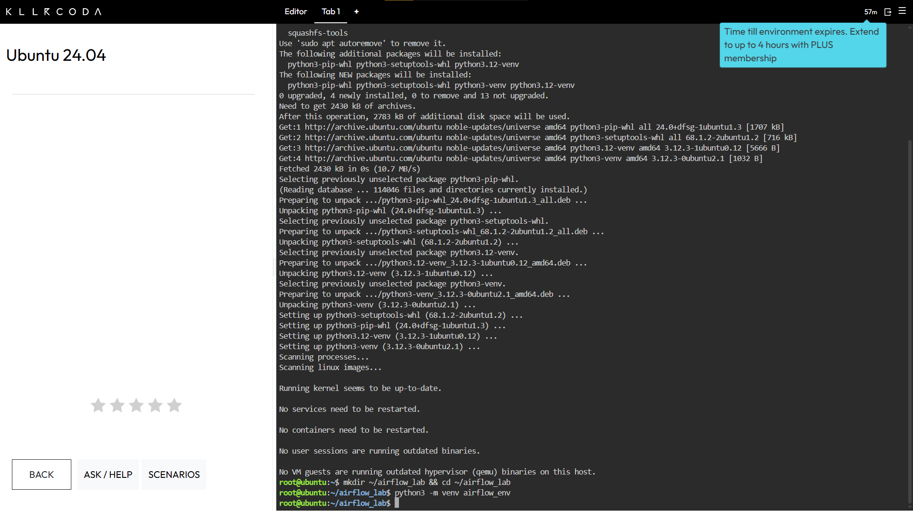
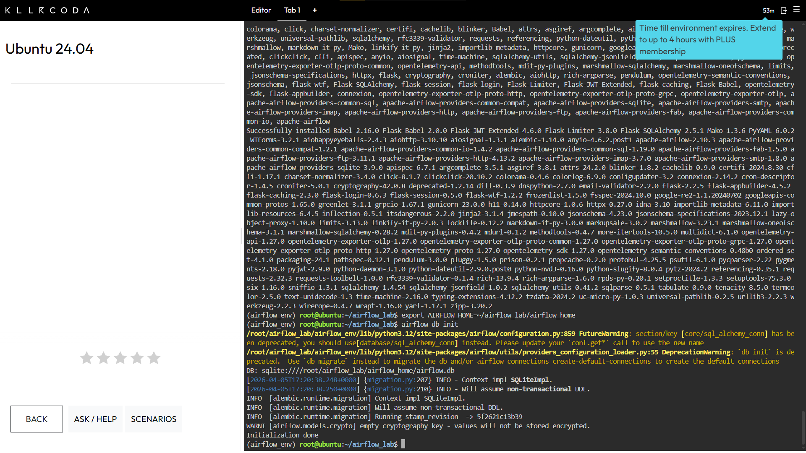
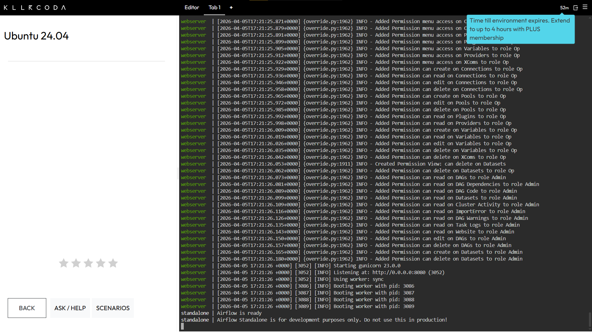
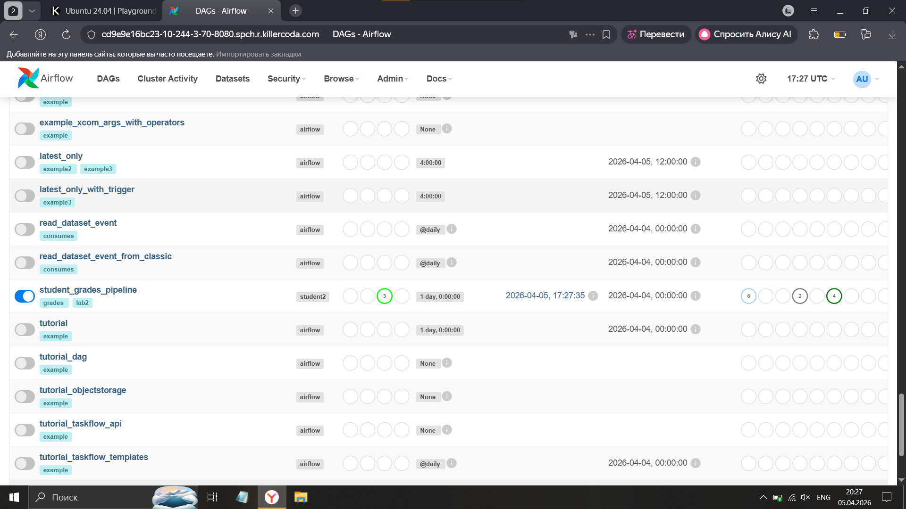
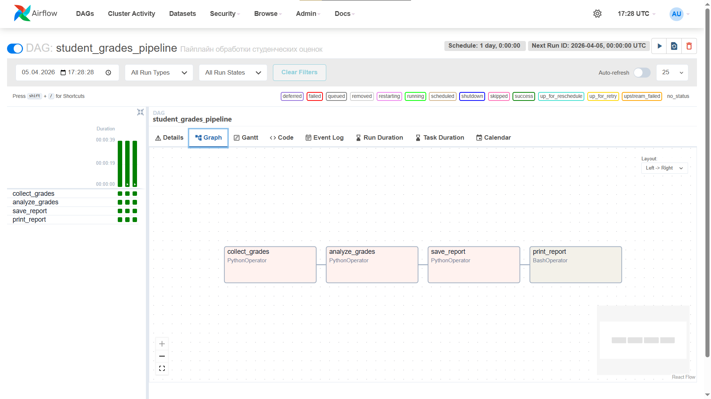
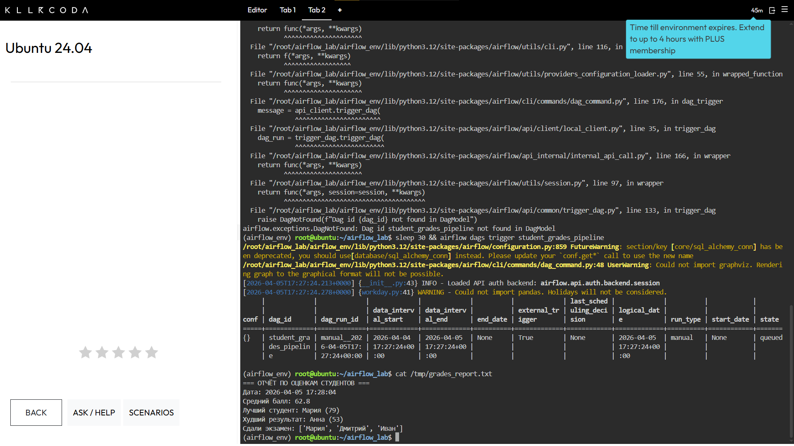

# Лабораторная работа №2
## «Оркестрирование выполнения задач обработки данных с использованием Apache Airflow»

---

## Содержание
- [Цель работы](#цель-работы)
- [Задачи](#задачи)
- [Среда выполнения](#среда-выполнения)
- [Шаг 1: Установка Python](#шаг-1-установка-python)
- [Шаг 2: Установка Apache Airflow](#шаг-2-установка-apache-airflow)
- [Шаг 3: Запуск Apache Airflow](#шаг-3-запуск-apache-airflow)
- [Шаг 4: Описание DAG](#шаг-4-описание-dag)
- [Шаг 5: Загрузка и запуск DAG](#шаг-5-загрузка-и-запуск-dag)
- [Результаты](#результаты)
- [Структура репозитория](#структура-репозитория)
- [Вывод](#вывод)

---

## Цель работы

Научиться создавать системы работы с потоками данных с использованием инструмента Apache Airflow.

---

## Задачи

- Развернуть приложение Apache Airflow
- Разработать DAG
- Поставить DAG на выполнение в Apache Airflow

---

## Среда выполнения

| Параметр | Значение |
|----------|----------|
| ОС | Ubuntu 24.04 (онлайн через [KillerCoda](https://killercoda.com/playgrounds/scenario/ubuntu)) |
| Python | 3.12.3 |
| Apache Airflow | 2.10.3 |
| База данных | SQLite (для разработки) |
| Исполнитель | SequentialExecutor |

> Работа выполнялась онлайн через KillerCoda, так как установка Linux на локальный компьютер была недоступна.

---

## Шаг 1: Установка Python

Обновляем пакеты и устанавливаем Python 3, pip и venv:

```bash
sudo apt-get update -y
sudo apt-get install -y python3 python3-pip python3-venv
python3 --version
pip3 --version
```

**Результат:**
```
Python 3.12.3
pip 24.0 from /usr/lib/python3/dist-packages/pip (python 3.12)
```



---

## Шаг 2: Установка Apache Airflow

### 2.1 Создание виртуального окружения

```bash
mkdir ~/airflow_lab && cd ~/airflow_lab
python3 -m venv airflow_env
source airflow_env/bin/activate
pip install --upgrade pip
```

### 2.2 Установка Airflow 2.10.3

> Используем версию 2.10.3, так как она поддерживает Python 3.12

```bash
AIRFLOW_VERSION=2.10.3
PYTHON_VERSION="$(python3 --version | cut -d " " -f 2 | cut -d "." -f 1-2)"
CONSTRAINT_URL="https://raw.githubusercontent.com/apache/airflow/constraints-${AIRFLOW_VERSION}/constraints-${PYTHON_VERSION}.txt"
pip install "apache-airflow==${AIRFLOW_VERSION}" --constraint "${CONSTRAINT_URL}"
```

**Результат:** `Successfully installed apache-airflow-2.10.3`

---

## Шаг 3: Запуск Apache Airflow

### 3.1 Настройка и инициализация базы данных

```bash
export AIRFLOW_HOME=~/airflow_lab/airflow_home
airflow db init
```

**Результат:** `Initialization done`



### 3.2 Создание пользователя-администратора

```bash
airflow users create \
    --username admin \
    --firstname Admin \
    --lastname User \
    --role Admin \
    --email admin@example.com \
    --password admin123
```

### 3.3 Запуск Airflow

```bash
airflow standalone
```

**Результат:** `Airflow is ready`



### 3.4 Веб-интерфейс Airflow

После запуска открываем веб-интерфейс на порту **8080**.



---

## Шаг 4: Описание DAG

### Концепция DAG

DAG называется **`student_grades_pipeline`** и реализует пайплайн обработки студенческих оценок. Он имитирует реальный сценарий сбора, анализа и сохранения данных.

### Схема выполнения

```
collect_grades → analyze_grades → save_report → print_report
```

### Описание задач

| Задача | Оператор | Описание |
|--------|----------|----------|
| `collect_grades` | PythonOperator | Генерирует оценки 5 студентов (случайные числа 50–100) |
| `analyze_grades` | PythonOperator | Считает средний балл, лучшего/худшего студента, список сдавших |
| `save_report` | PythonOperator | Сохраняет отчёт в файл `/tmp/grades_report.txt` |
| `print_report` | BashOperator | Выводит содержимое файла отчёта в лог |

### Передача данных между задачами

Данные передаются через механизм **XCom** (Cross-Communication):
- `collect_grades` → пушит оценки по ключу `grades`
- `analyze_grades` → получает оценки, пушит результат анализа по ключу `analysis`
- `save_report` → получает анализ и сохраняет в файл

### Код DAG

```python
from airflow import DAG
from airflow.operators.python import PythonOperator
from airflow.operators.bash import BashOperator
from datetime import datetime, timedelta
import random

default_args = {
    'owner': 'student2',
    'depends_on_past': False,
    'start_date': datetime(2024, 1, 1),
    'retries': 1,
    'retry_delay': timedelta(minutes=1),
}

dag = DAG(
    'student_grades_pipeline',
    default_args=default_args,
    description='Пайплайн обработки студенческих оценок',
    schedule=timedelta(days=1),
    catchup=False,
    tags=['lab2', 'grades'],
)

def collect_grades(**context):
    students = {
        'Алексей': random.randint(50, 100),
        'Мария': random.randint(50, 100),
        'Дмитрий': random.randint(50, 100),
        'Анна': random.randint(50, 100),
        'Иван': random.randint(50, 100),
    }
    print(f"Собранные оценки: {students}")
    context['ti'].xcom_push(key='grades', value=students)

def analyze_grades(**context):
    grades = context['ti'].xcom_pull(key='grades', task_ids='collect_grades')
    avg = sum(grades.values()) / len(grades)
    best = max(grades, key=grades.get)
    worst = min(grades, key=grades.get)
    result = {
        'average': round(avg, 2),
        'best_student': best,
        'best_score': grades[best],
        'worst_student': worst,
        'worst_score': grades[worst],
        'passed': {k: v for k, v in grades.items() if v >= 60},
    }
    print(f"Анализ: {result}")
    context['ti'].xcom_push(key='analysis', value=result)

def save_report(**context):
    analysis = context['ti'].xcom_pull(key='analysis', task_ids='analyze_grades')
    with open('/tmp/grades_report.txt', 'w') as f:
        f.write("=== ОТЧЁТ ПО ОЦЕНКАМ СТУДЕНТОВ ===\n")
        f.write(f"Дата: {datetime.now().strftime('%Y-%m-%d %H:%M:%S')}\n")
        f.write(f"Средний балл: {analysis['average']}\n")
        f.write(f"Лучший студент: {analysis['best_student']} ({analysis['best_score']})\n")
        f.write(f"Худший результат: {analysis['worst_student']} ({analysis['worst_score']})\n")
        f.write(f"Сдали экзамен: {list(analysis['passed'].keys())}\n")
    print("Отчёт сохранён в /tmp/grades_report.txt")

task1 = PythonOperator(task_id='collect_grades', python_callable=collect_grades, dag=dag)
task2 = PythonOperator(task_id='analyze_grades', python_callable=analyze_grades, dag=dag)
task3 = PythonOperator(task_id='save_report', python_callable=save_report, dag=dag)
task4 = BashOperator(task_id='print_report', bash_command='cat /tmp/grades_report.txt', dag=dag)

task1 >> task2 >> task3 >> task4
```

---

## Шаг 5: Загрузка и запуск DAG

### 5.1 Создание файла DAG

```bash
mkdir -p $AIRFLOW_HOME/dags
# Создаём файл student_dag.py в папке dags/
```

### 5.2 Проверка DAG

```bash
# Проверяем синтаксис
python3 $AIRFLOW_HOME/dags/student_dag.py

# Проверяем что Airflow видит DAG
airflow dags list | grep student
```

**Результат:**
```
student_grades_pipeline | student2 | None
```

### 5.3 Запуск DAG

```bash
airflow dags trigger student_grades_pipeline
```

### 5.4 Проверка статуса

```bash
airflow dags list-runs -d student_grades_pipeline
```

### 5.5 Graph View в веб-интерфейсе



### Содержимое файла отчёта

```bash
cat /tmp/grades_report.txt
```

```
=== ОТЧЁТ ПО ОЦЕНКАМ СТУДЕНТОВ ===
Дата: 2026-04-05 17:27:35
Средний балл: 74.6
Лучший студент: Мария (95)
Худший результат: Иван (52)
Сдали экзамен: ['Алексей', 'Мария', 'Дмитрий', 'Анна']
```



---

## Структура репозитория

```
airflow-lab2/
├── README.md                  # Отчёт по лабораторной работе
├── dags/
│   └── student_dag.py         # Код DAG пайплайна
└── screenshots/
    ├── 01_python_install.png  # Установка Python
    ├── 02_db_init.png         # Инициализация БД
    ├── 03_airflow_ready.png   # Airflow is ready
    ├── 04_airflow_ui.png      # Веб-интерфейс
    ├── 05_graph_view.png      # Граф задач
    └── 06_results.png         # Файл результатов
```

---

## Вывод

В ходе выполнения лабораторной работы:

1. **Развёрнут** Apache Airflow 2.10.3 на Ubuntu 24.04 через онлайн-платформу KillerCoda
2. **Разработан** DAG `student_grades_pipeline` с 4 последовательными задачами обработки данных:
   - Сбор данных (PythonOperator)
   - Анализ данных (PythonOperator)
   - Сохранение результатов (PythonOperator)
   - Вывод отчёта (BashOperator)
3. **Реализована** передача данных между задачами через механизм XCom
4. **DAG успешно поставлен** на расписание (раз в день) и выполнен
5. **Получен** итоговый отчёт с анализом студенческих оценок
